# Schelling-s-model-of-segregation
Progetto realizzato per l'esame di Programmazione Concorrente, Parallela e su Cloud 2022-2023.

- Studente: **Francesco Parisi**
- Matricola: **0522500983**
- Project ID: **3**

## **Indice** ##
- [**Introduzione**](#introduzione)
- [**Soluzione proposta**](#soluzione-proposta)
  - [**Inizializzazione della matrice**](#inizializzazione-della-matrice)
  - [**Suddivisione della matrice**](#suddivisione-della-matrice)
  - [**Scambio delle righe**](#scambio-delle-righe)
  - [**Valutazione della soddisfazione**](#valutazione-della-soddisfazione)
  - [**Identificazione delle celle cuote**](#identificazione-delle-celle-vuote)
  - [**Scambio delle posizioni**](#scambio-delle-posizioni)
  - [**Spostamento degli agenti**](#spostamento-degli-agenti)
  - [**Recupero della matrice**](#recupero-della-matrice)
- [**Note su Compilazione ed Esecuzione**](#note-su-compilazione-ed-esecuzione)
- [**Benchmarking**](#benchmarking)
  - [**Scalabilità Forte**](#scalabilità-forte)
  - [**Scalabilità Debole**](#scalabilità-debole)
  - [**Risultati Ottenuti**](#risultati-ottenuti)
- [**Conclusioni**](#conclusioni)


## **Introduzione**
Il modello di segregazione di Schelling è una dimostrazione di come piccole preferenze individuali possano generare grandi effetti complessivi a livello di società. Progettato originariamente da Thomas Schelling, economista degli anni '60 e '70 del Novecento, questo modello agent-based svela che, anche in presenza di una preferenza di tipo etnico, sociale o culturale, le scelte individuali possono portare a una totale segregazione. 

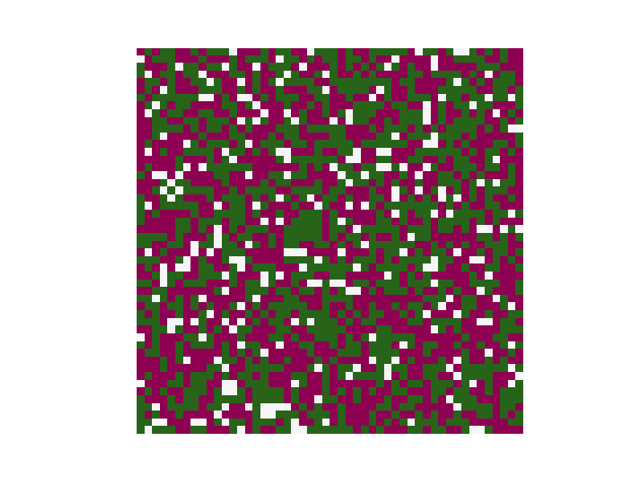

Il modello opera attraverso una griglia popolata da agenti divisi in due gruppi distinti. Ogni agente, con l'ambizione di avere almeno il 30% del proprio vicinato appartenente al suo gruppo, si sposta se tale criterio non è soddisfatto, puntando sempre a uno spazio libero. La simulazione procede fino a quando ognuno degli agenti è contento della propria posizione o si raggiunge un numero massimo di step. 

L'obiettivo del progetto è quello di replicare tale simulazione mediante un'implementazione in linguaggio C, avvalendosi della potenza e versatilità della libreria MPI. Questa implementazione del modello punta non solo a emulare il fenomeno di segregazione, ma anche a sottolineare l'importanza e l'efficacia della programmazione parallela nel trattare problemi complessi.

## **Soluzione proposta**
La soluzione proposta per l'implementazione di tale modello si concentra sull'efficienza e sulla collaborazione tra i vari processori. Fondamentalmente, la strategia si articola attraverso un sistema in cui ogni processore lavora su sottomatrici specifiche, garantendo che queste siano equamente suddivise. Questo approccio non solo ottimizza l'uso delle risorse computazionali, ma facilita anche una computazione più rapida ed efficiente.

La soluzione è caratterizzata da diverse fasi:
1. **Inizializzazione della matrice**: Il processo root inizializza la matrice al fine di garantire che tutte le posizioni degli agenti e le celle vuote siano correttamente stabilite prima dell'elaborazione parallela.
2. **Suddivisione della matrice**: La matrice inizialmente viene frammentata in sottomatrici (quasi) uguali, consentendo una distribuzione omogenea del carico di lavoro tra i processori.
3. **Scambio delle righe**: Le righe vengono scambiate tra i processi contigui. Questo interscambio è essenziale per determinare la soddisfazione (locale) degli agenti presenti nella sottomatrice.
4. **Valutazione della soddisfazione**: Durante questa fase, ogni processo calcola la soddisfazione di ogni agente all'interno della sua sottomatrice assegnata. Questo determina quali agenti sono soddisfatti della loro posizione attuale e quali desiderano spostarsi.
5. **Identificazione delle celle vuote**: Ogni processo analizza la sua sottomatrice per calcolare il numero di celle vuote e determinare le loro posizioni esatte. Questo è essenziale per decidere successivamente dove gli agenti insoddisfatti possono essere spostati.
6. **Scambio delle posizioni**: Una volta identificate le celle vuote, le loro posizioni vengono condivise tra tutti i processi. Questo assicura che ogni processo abbia una visione completa delle posizioni disponibili per lo spostamento degli agenti.
7. **Spostamento degli agenti**: Basandosi sulle informazioni raccolte nelle fasi precedenti, gli agenti insoddisfatti vengono spostati nelle celle vuote identificate. Ogni processo gestisce lo spostamento degli agenti all'interno della sua sottomatrice.
8. **Recupero della matrice**: Dopo che tutti gli agenti sono stati spostati, le sottomatrici vengono raccolte e combinate per formare la matrice finale. Questa matrice rappresenta lo stato aggiornato di tutti gli agenti, e viene quindi utilizzata per calcolare la soddisfazione globale.

### **Inizializzazione della matrice**
Il primo passo è stato quello di inizializzare la matrice. Per la generazione della matrice, l'utente può cambiare diversi parametri stesso all'interno del codice sorgente, come: dimensione della matrice, soglia di soddisfazione, numero di iterazioni, percentuale di popolazione di agenti.
Questa flessibilità consente allo sviluppatore di adattare la dimensione della matrice alle proprie esigenze, senza riscrivere l'intero codice. La matrice, con dimensioni scelte dall'utente, viene popolata con agenti X, O o celle vuote (' ').

Di seguito viene mostrato lo snippet di codice interessato:

```c
//Agenti
#define AGENT_X 'X'
#define AGENT_O 'O'
#define EMPTY ' '
#define EMPTY_CELL -1
#define SATISFIED 0
#define UNSATISFIED 1

//Setting della percentuale di popolazione degli Agenti X e O
#define PERC_O 33
#define PERC_X 33

//Setting della sogliax di soddisfazione
#define PERCENTAGE_SAT 33.333

//Righe e Colonne della MAtrice
#define ROWS 100
#define COLUMNS 100

//Setting del numero max di iterazioni
#define ITER 100

//Macro per definire il colore di ogni agente della matrice
#define PRINT_RED(str) printf("\x1b[1;31m %c \x1b[0m", str);
#define PRINT_BLUE(str) printf("\x1b[1;36m %c \x1b[0m", str);

```
Sulla base di tali parametri, il processo root ha il compito di inizializzare la matrice.

```c
    if (rank == 0) {
        matrix = malloc(ROWS * COLUMNS * sizeof(char *));

        print_init_info(size);
        printf("\n🚩 Initial Matrix:\n\n");
        matrix_init(matrix, PERC_O, PERC_X);
        print_matrix(ROWS, COLUMNS, matrix);
    }
```
La funzione `print_init_info()` fornisce una panoramica contestuale, informando l'utente su data e ora di avvio, sul numero di processori coinvolti e sul numero totale di iterazioni.

Per riempire correttamente la matrice appena inizializzata vengono chiamate due funzioni: `matrix_init()` è `print_matrix()`.

La funzione `matrix_init()` effettua l'operazione di riempimento. Genera un numero casuale **number** tra 1 e 100 e, in base al suo valore, assegna un tipo di agente o lascia la cella vuota. 

```c
char matrix_init(char *matrix, int pa_x, int pa_y){
    for (int i = 0; i < ROWS; i++) {
        for (int j = 0; j < COLUMNS; j++) {
                
                //Viene assegnato un numero casuale tra 1 e 100
                int number = rand()%100+1;
                if(number>0 && number<= PERC_O)
                    matrix[i * COLUMNS + j] = AGENT_O;
                else if(number>PERC_O && number<= (PERC_O+PERC_X))
                    matrix[i * COLUMNS + j] = AGENT_X;
                else
                    matrix[i * COLUMNS + j] = EMPTY;
        }
    }
}
```

Come è possibile vedere dalla funzione, tale logica di assegnazione consiste nell'inserire l'agente:

- **X** se number>PERC_O && number<= (PERC_O+PERC_X);
- **O** se number>0 && number<= PERC_O;
- **' '** altrimenti;

**⚠️Non è possibile creare una matrice con un numero di righe maggiore del numero di processi con cui si decide di eseguire il programma** 
> Limitando il numero di righe al numero di processi, al crescere del numero di processi (e quindi delle righe), il lavoro sia distribuito in modo ottimale tra i processi, mantenendo l'efficienza e la scalabilità.

Una volta configurata, la matrice è visualizzata a terminale attraverso la funzione `print_matrix()`. Questa funzione, sfruttando `print_random_agent()`, stampa gli agenti <font color="#4495e6">**X**</font> in blu e gli agenti <font color="red">**O**</font> in rosso, mentre le celle vuote vengono rappresentate come spazi. Questo comportamento è garantito dalle macro PRINT_BLUE e PRINT_RED.

### **Suddivisione della matrice**
In questa fase l'obiettivo principale è distribuire equamente le righe della matrice tra i vari processi coinvolti, considerando le dimensioni della matrice e il numero di processi. Questo compito è gestito dalla funzione `rows_distribution()`.

All'inizio, si calcola quante righe ogni processo dovrebbe ricevere, effettuando una semplice divisione: int rows_send = rows / size;. Tuttavia, se la divisione non è perfettamente equa, ovvero se ci sono delle righe 'extra' (determinate dal modulo rows % size), queste vengono assegnate ai processi uno alla volta, finché tutte le righe extra non sono state distribuite. Questa logica è evidente nel seguente blocco di codice:

```c
if (rows_rest > 0) {
    sendcounts[i] += COLUMNS;
    rows_proc[i]++;
    rows_rest--;
}
```
Oltre alla distribuzione iniziale delle righe, ogni processo, a eccezione del primo e dell'ultimo, riceve anche due righe extra, al fine di 'ospitare' le righe dei processi adiacenti. Il primo e l'ultimo processo ricevono solo una riga extra, in quanto hanno rispettivamente solo un processo adiacente a destra o a sinistra. Il motivo di ciò è stato quello di non implementare la matrice come una struttura circolare.

```c
sub_matrix = malloc(rows_process[rank] * COLUMNS * sizeof(char *));
MPI_Scatterv(matrix, sendcounts, displacements, MPI_CHAR, sub_matrix, rows_process[rank] * COLUMNS, MPI_CHAR, 0, MPI_COMM_WORLD);
```
La matrice iniziale viene divisa in sottomatrici e inviate dal processo root a tutti gli altri processi tramite la funzione **MPI_Scatterv()**.

### **Scambio delle righe**
A questo punto risulta essenziale che i processi condividano dati tra loro. Pertanto, uno degli aspetti cruciali è lo scambio di righe tra sottomatrici gestite da processi vicini. L'intento è far sì che i processi abbiano accesso alle informazioni necessarie dai loro vicini senza la necessità di condividere l'intera matrice.

il seguente codice determina se un dato processo è "al bordo" dell'insieme di processi, cioè se è il primo o l'ultimo nella sequenza:

```c
bool edge_process = (rank == 0 || rank == size - 1);
```
Se un processo si trova al bordo, avrà comportamenti leggermente diversi durante lo scambio rispetto ai processi che non sono ai bordi.

Successivamente, ogni processo identifica i suoi processi vicini "superiore" e "inferiore" con cui dovrà scambiare le righe:

```c
int neighbour_up = (rank + 1) % size;
int neighbour_down = (rank + size - 1) % size;
```

Prima di procedere con la comunicazione, ogni processo stabilisce dove si trovano le righe che deve inviare e dove dovrebbe ricevere le righe dai suoi vicini:

```c
int my_last_row_pos = (initial_rows - 1) * COLUMNS; 
int neighbour_down_row_pos = initial_rows * COLUMNS; 
int neighbour_up_row_pos = (initial_rows + (rank == 0 ? 0 : 1)) * COLUMNS;  
```

L'effettivo scambio di righe viene eseguito tramite funzioni di comunicazione non bloccanti fornite da MPI. Se un processo non è il primo nella sequenza, esso invierà e riceverà dati dal suo vicino inferiore. Allo stesso modo, se un processo non è l'ultimo, esso comunicherà con il suo vicino superiore:

```c

// Se il processo non è root invia la prima riga al vicino inferiore e riceve una riga dallo stesso vicino, che verrà memorizzata subito dopo l'ultima riga della sua sottomatrice
if (rank != 0) {
    MPI_Isend(sub_matrix, COLUMNS, MPI_CHAR, neighbour_down, 99, communicator, &requests[request_count++]);
    MPI_Irecv(sub_matrix + neighbour_down_row_pos, COLUMNS, MPI_CHAR, neighbour_down, 99, communicator, &requests[request_count++]);
}

// Se il processo non è l'ultimo invia l'ultima riga al vicino superiore e riceve una riga dallo stesso vicino, che verrà memorizzata alla fine o subito dopo l'ultima riga, a seconda del rank
if (rank != size - 1) {
    MPI_Isend(sub_matrix + my_last_row_pos, COLUMNS, MPI_CHAR, neighbour_up, 99, communicator, &requests[request_count++]);
    MPI_Irecv(sub_matrix + neighbour_up_row_pos, COLUMNS, MPI_CHAR, neighbour_up, 99, communicator, &requests[request_count++]);

//Si attende che tutte le operazioni non bloccanti siano completate 
MPI_Waitall(request_count, requests, MPI_STATUSES_IGNORE);
}
```

Dopo aver avviato tutte le operazioni di comunicazione, tramite `MPI_Waitall()` il processo attende che tutte le operazioni siano state completate, garantendo così l'integrità dei dati.

### **Valutazione della soddisfazione**
La soddisfazione degli agenti all'interno di ciascuna sottomatrice viene valutata tramite la funzione `assess_agent_satisfaction()`. 

```c
int *assess_agent_satisfaction(int rank, int size, int initial_rows, int total_rows, char *sub_matrix, int *unsatisfied_agents) {
    int *mat = malloc(initial_rows * COLUMNS * sizeof(int *));

    //Contatore degli agenti insoddisfatti, inizializzato a 0
    *unsatisfied_agents = 0;

    for (int i = 0; i < initial_rows; i++) {
        for (int j = 0; j < COLUMNS; j++) {
            int idx = i * COLUMNS + j;

            //Viene verificato se la cella non è vuota, in tal caso viene assegnato un valore intero (SATISFIED:0, UNSATISFIED:1)
            if (sub_matrix[idx] != EMPTY) {

                //Creazione di una matrice caratterizzata dal valore di soddisfazione di ogni agente
                mat[idx] = is_satisfied(rank, size, initial_rows, total_rows, i * COLUMNS, j, sub_matrix) ? SATISFIED : UNSATISFIED;

                //Viene aggiornato il conteggio degli agenti insoddisfatti
                *unsatisfied_agents += (mat[idx] == UNSATISFIED) ? 1 : 0;
            }
            else {
                mat[idx] = EMPTY_CELL;
            }
        }
    }

    return mat;
}
```
Questa funzione restituisce una nuova matrice, di dimensioni analoghe a quelle della sottomatrice iniziale, escludendo eventuali righe aggiuntive e facilitando le operazioni di spostamento degli agenti non soddisfatti nelle fasi successive dell'algoritmo.

La matrice risultante è strutturata in modo che ogni cella [i][j] contenga un valore intero, indicante lo stato di soddisfazione dell'agente:

- **0**: rappresenta un agente che è soddisfatto e non ha intenzione di spostarsi;
- **1**: indica un agente che non è soddisfatto e desidera spostarsi;
- **-1**: denota una cella vuota, disponibile per ospitare gli agenti che desiderano spostarsi.

La soddisfazione di un agente è definita in base ai suoi vicini. Un agente è considerato soddisfatto se almeno il 33.333% dei suoi vicini è simile a lui. Di conseguenza, le celle contenenti un agente di tipo opposto o che sono vuote non contribuiscono positivamente alla soddisfazione. È anche importante sottolineare che, nel caso in cui un agente si trovi ai bordi della matrice, questo avrà meno vicini, influenzando così il suo stato di soddisfazione.

La funzione `is_satisfied()` gioca un ruolo importante nel determinare la soddisfazione di un agente.
Il funzionamento può essere descritto nei seguenti passi:

- **Identificazione dei vicini**: In base alla posizione corrente dell'agente nella sottomatrice, la funzione identifica i suoi potenziali vicini. Se l'agente è vicino a un bordo della matrice, avrà meno vicini.

- **Gestione dei bordi**: Ogni agente potrebbe trovarsi su uno dei bordi della sottomatrice, e la funzione tiene conto di ciò determinando i suoi vicini. Per esempio, se un agente è sul bordo superiore della sottomatrice, non avrà vicini sopra di lui.

- **Confronto con i vicini**: Una volta identificati i vicini, l'agente viene confrontato con ciascuno di essi. L'obiettivo è contare quanti di questi vicini sono "simili" all'agente.

- **Decisione finale**: Dopo aver contato i vicini simili, la funzione calcola una percentuale di somiglianza. Se questa percentuale supera un certo limite (33.333%), l'agente è considerato soddisfatto.

### **Identificazione delle celle vuote**
In questa fase bisogna determinare le posizioni disponibili in cui gli agenti insoddisfatti potranno essere spostati nella fase successiva. Ogni processo analizza la sottomatrice assegnata e calcola il numero totale di celle vuote presenti, determinando anche le posizioni esatte di tali celle vuote.
Per procedere con la corretta identificazione di tali celle, viene chiamata la funzione `find_empty_cells()`. 
Tale funzione cerca le celle vuote nella sottomatrice data in input e restituisce una array di strutture.

Cio è stato possibile definendo innanzitutto la struttua **empty_cell**:

```c
typedef struct {
    int row_index;
    int column_index;
} empty_cell;
```

**empty_cell** fornisce informazioni relative alle coordinate di una cella vuota, informazioni che serviranno per la fase di spostamento degli agenti.

Nel dettaglio, per prima cosa viene allocato dinamicamente lo spazio per il numero massimo possibile di celle vuote. Questo è fatto per garantire che ci sia spazio sufficiente per tutte le possibili celle vuote nella sottomatrice:

```c
empty_cell *emptyCells = malloc(initial_rows * COLUMNS * sizeof(empty_cell));
```

Successivamente, si procede con due cicli **for**, per cercare le celle vuote presenti nella sottomatrice:

```c
// Ricerca delle celle vuote nella sottomatrice, cercando in ogni singola cella
for (int i = 0; i < initial_rows; i++) {
    for (int j = 0; j < COLUMNS; j++) {
        if (sub_matrix[i * COLUMNS + j] == EMPTY) {
            //Viene impostato l'indice della riga e della colonna per la cella corrente
            currentCell->row_index = displacement + i * COLUMNS;
            currentCell->column_index = j;
            currentCell++;
        }
    }
}

//Ridimensionamento di emptyCells per adattarsi al numero di celle effettivamente vuote
int foundCells = currentCell - emptyCells;
emptyCells = realloc(emptyCells, foundCells * sizeof(empty_cell));
    *local_empty_cells = foundCells;
```
Se la cella è vuota, i valori di indice di riga e colonna vengono impostati per la cella vuota corrente. Dopo aver impostato questi valori, il puntatore **currentCell** viene incrementato per passare alla prossima cella vuota.

Come è possibile notare dal codice precedente, una volta individuate le celle vuote si è proceduto con il ridimensionamento di **emptyCell**, questo per adattarsi al numero esatto di celle vuote.

### **Scambio delle posizioni**
Dopo aver identificato le celle vuote, il passo successivo ha comportato il calcolo e la distribuzione delle celle vuote tra i vari processi, al fine di spostare successivamente gli agenti insoddisfatti.

Il processo inizia con la funzione `distribute_empty_positions()`, la quale gestisce la logica di raccolta e distribuzione delle celle vuote. Le posizioni sono prima raccolte da tutti i processi, quindi mescolate e infine distribuite nuovamente. La raccolta delle informazioni relative alle celle vuote è stata possibile grazie alla funzione`MPI_Allgatherv()`, la quale ha permesso ad ogni processo di condividere sia il numero di celle vuote che possiede sia le loro posizioni con tutti gli altri processi, garantendo che ognuno abbia una vista completa delle celle vuote disponibili in tutto il sistema.

```c
//Per ogni processo viene raccolto il numero di celle vuote locali e vengono memorizzate nell'array num_global_empty_cells
MPI_Allgather(&num_local_empty_cells, 1, MPI_INT, num_global_empty_cells, 1, MPI_INT, MPI_COMM_WORLD);

//Per ogni processo vengono raccolte le posizioni delle celle vuote e memorizzate in global_empty_cells
MPI_Allgatherv(local_empty_cells, num_local_empty_cells, datatype, global_empty_cells, num_global_empty_cells, displacements, datatype, MPI_COMM_WORLD);
    
```
 Le celle vuote vengono dunque mescolate casualmente, attraverso la funzione `shuffle_global_empty_cells()`. Questa funzione utilizza un seme fisso per assicurarsi che l'ordine casuale generato sia coerente tra diverse esecuzioni.

L'allocazione delle celle vuote viene gestita dalla funzione `calculate_empty_cells_per_process()`. La logica è la seguente: un processo che non ha agenti insoddisfatti non riceverà celle vuote, poiché non ne avrà bisogno. Ciò garantisce che le risorse (in questo caso, le posizioni vuote) vengano assegnate in modo efficiente ai processi che ne hanno effettivamente bisogno.

Infine, per l'effettiva distribuzione delle posizioni relative alle celle vuote tra i vari processi viene chiamata la funzione `MPI_Scatterv()`:

```c
//Distribuzione delle posizioni vuote tra i vari processi
MPI_Scatterv(global_empty_cells, empty_cells_per_process, displacements, datatype, empty_cell_current_proc, empty_cells_per_process[rank], datatype, 0, MPI_COMM_WORLD);

```

In questo modo ogni processo saprà quante e quali celle vuote gli sono state assegnate e si potrà procecedere con lo spostamento degli agenti insoddisfatti.

### **Spostamento degli agenti**
Una volta assegnate le celle vuote ai vari processi, la logica di spostamento degli agenti viene gestita nella funzione `move_agents()`. Questa funzione inizializza l'array **num_elems_to_send_to** che terrà traccia di quanti agenti il processo corrente deve inviare a ciascun altro processo, e la matrice **data**, dove ogni riga rappresenta un processo e ogni colonna contiene informazioni dettagliate sull'agente da spostare.

```c
int *num_elems_to_send_to = (int *)calloc(size, sizeof(int));
move_agent **data = (move_agent **)malloc(sizeof(move_agent *) * size);
```
Il codice poi scorre tutte le celle della sottomatrice alla ricerca di agenti da spostare. Se trova un agente insoddisfatto, determina la sua cella di destinazione e calcola quale processo dovrebbe gestire lo spostamento (receiver). Se l'agente può essere spostato all'interno del processo corrente, lo fa immediatamente. Altrimenti, raccoglie le informazioni necessarie per spostare l'agente verso un altro processo.

```c
//Se il processo receiver è quello corrente, sposta l'agente all'interno della sottomatrice
if (receiver == rank) {
    sub_matrix[destRow + destination.column_index] = sub_matrix[current_index];
    move[destRow + destination.column_index] = 0;
} else {
    //Creazione di una struct con le informazioni sullo spostamento e la aggiunge all'array dei dati destinati al processo receiver
    move_agent var = {destRow, destination.column_index, sub_matrix[current_index]};
    data[receiver][num_elems_to_send_to[receiver]++] = var;
}
```
Inotre, è necessario garantire una corretta sincronizzazione tra i processi per assicurare che gli agenti vengano spostati correttamente. Qui entra in gioco la funzione `sync()`. Questa funzione si occupa della sincronizzazione dei dati tra i processi, utilizzando chiamate MPI asincrone come **MPI_Isend** e **MPI_Irecv** per inviare e ricevere informazioni in modo non bloccante. In particolare, per ogni processo vengono inviate e ricevute informazioni sugli agenti da spostare, assicurando che tutti i processi siano allineati nel loro stato corrente.

```c
//Invia in modo asincrono al processo i il numero di elementi che il processo corrente intende inviare
MPI_Isend(&num_elems_to_send_to[i], 1, MPI_INT, i, 99, MPI_COMM_WORLD, &requests1[i]);

//Riceve in modo asincrono dal processo i il numero di celle vuote utilizzate da quel processo
MPI_Irecv(&empty_cell_used[i], 1, MPI_INT, i, 99, MPI_COMM_WORLD, &requests1[i]);

```
Una volta che tutte le comunicazioni sono state completate e tutti i dati sono stati ricevuti, ogni processo aggiorna la propria sottomatrice con gli agenti ricevuti. Questo passaggio assicura che tutti gli agenti siano stati correttamente spostati alle loro nuove posizioni.

### **Recupero della matrice**
Dopo che tutti i processi hanno completato le loro operazioni sulle sottomatrici, è necessario raccogliere i risultati in una singola matrice finale. Questo compito viene gestito dalla funzione `MPI_Gatherv()`, ovvero un'operazione collettiva usata per raccogliere dati da tutti i processi partecipanti e unirli in un singolo buffer del processo "root".

```c
//Raccolta delle sottomatrici processate da ciascun processo nel processo root
MPI_Gatherv(sub_matrix, sendcounts[rank], MPI_CHAR, matrix, sendcounts, displacements, MPI_CHAR, 0, MPI_COMM_WORLD);
```
Una volta raccolti tutti i dati, solo il processo root procede con la stampa della matrice finale e con il calcolo del livello di soddisfazione ottenuto. In particolare, viene chiamata la funzione `final_satisfaction()` per calcolare il livello di soddisfazione globale. Questa funzione inizializza una struct **info_agents** e un array **not_satisfied_agents** per tenere traccia degli agenti che non sono soddisfatti. Ogni cella della matrice viene esaminata in sequenza, contando il numero totale di agenti e il numero di agenti di ciascun tipo. 

```c
//Scorre ogni cella della matrice
for (int i = 0; i < ROWS; i++) {
    for (int j = 0; j < COLUMNS; j++) {
        char agent_type = matrix[i * COLUMNS + j];

        //Verifica se la cella non è vuota
        if (agent_type != EMPTY) {
            agents_info.tot_agents++;

            //Se incontro l'agente X, incremento il contatore, lo stesso in presenza dell'agente O
            if (agent_type == 'X') agents_info.tot_x_agents++;
            if (agent_type == 'O') agents_info.tot_o_agents++;
            
            //Verifica se l'agente nella cella corrente è soddisfatto, in tal caso passa alla cella successiva
            if (is_satisfied(rank, size, ROWS, ROWS, i * COLUMNS, j, matrix)) {
                continue;
            } else {
                //Aggiunge l'agente all'array degli agenti insoddisfatti e incrementa il contatore
                move_agent var = {i * COLUMNS, j, agent_type};
                not_satisfied_agents[unsatisfied_count] = var;
                unsatisfied_count++;
            }
        }
    }
}
```
Alla fine della scansione della matrice, la percentuale di soddisfazione viene calcolata come il rapporto tra il numero totale di agenti soddisfatti e il numero totale di agenti, e viene poi moltiplicata per 100. Questa percentuale viene quindi stampata insieme ad altre informazioni rilevanti.

Di seguito vengono fornite le immagini che mostrano una matrice iniziale e finale, con rispettivamente satuazione al 33.3% e al 40%:

|    **Matrice iniziale 100x100  (Sat. 33.3%)**    |    **Matrice iniziale 100x100  (Sat. 40%)**    |
| :--------------------------------------------: | :----------------------------------------: |
| 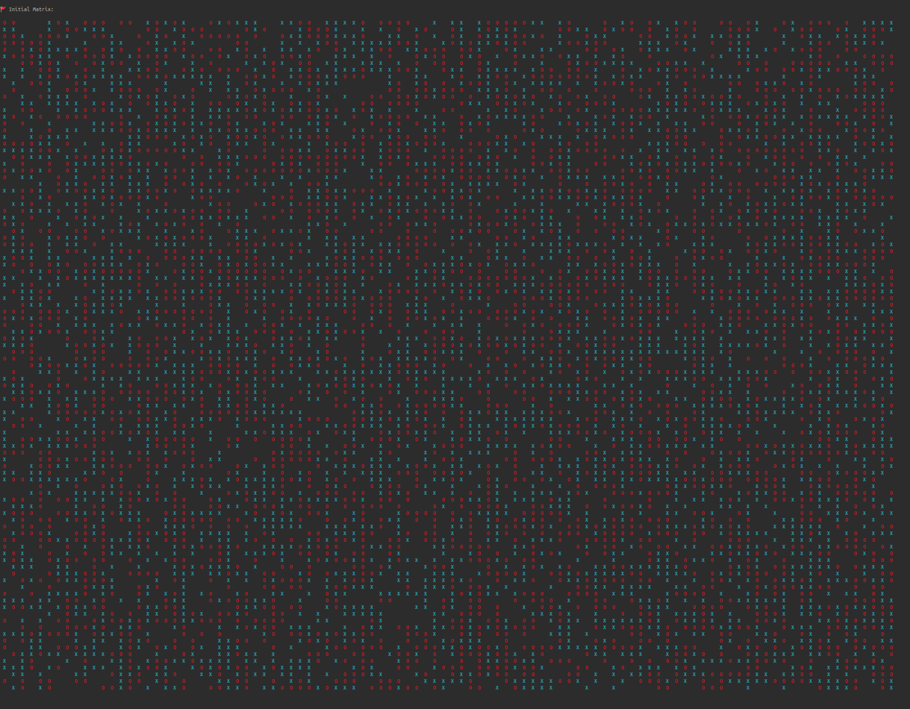                      | 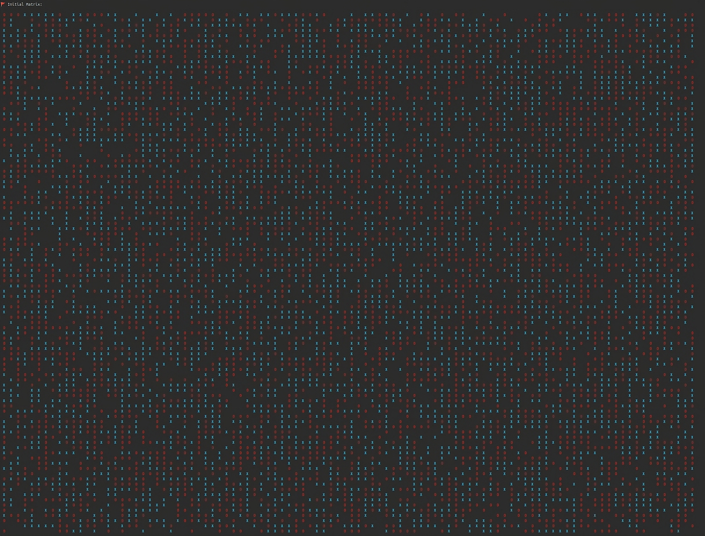                  |


|     **Matrice finale 100x100   (Sat. 33.3%)**      |     **Matrice finale 100x100  (Sat. 40%)**     |
| :--------------------------------------------: | :----------------------------------------: |
| 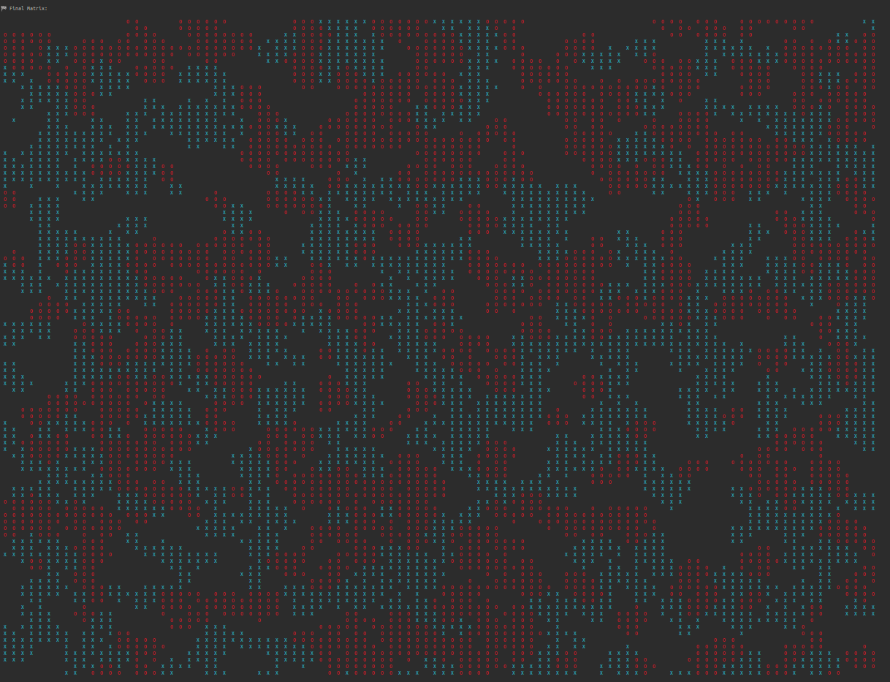                      |                   |


## **Note su Compilazione ed Esecuzione**
Per compilare il codice sorgente `schelling.c`, utilizzare il seguente comando:

```bash
mpicc schelling.c -o schelling
```
Dopo la compilazione, per eseguire il programma, utilizzare:
```bash
mpirun --allow-run-as-root --mca btl_vader_single_copy_mechanism none -np <numero_processi> schelling
```

## **Benchmarking**
Nella fase di benchmarking, l'implementazione è stata  testata su un cluster GCP composto da sei macchine di tipo <a href="https://cloud.google.com/compute/docs/general-purpose-machines?hl=it" target="_blank">**e2-highcpu-4**</a> (US-central1), ognuna con 4 vCPU e 4GB di RAM, per un totale di 24 vCPUs e 24GB di RAM e con un costo complessivo di circa 8.79$. Le prove sono state condotte per esaminare due principali metriche di scalabilità: la scalabilità forte e la scalabilità debole. Tali metriche sono concepite per comprendere come un sistema parallelo si comporta al variare del numero di processori. Pertanto, per ogni test è stato valutato il tempo di esecuzione e l'efficienza dell'implementazione.

Nota: Per ogni test svolto, sono state effettuate tre ripetizioni ognuno e calcolata la mediana, riducendo così eveuntali valori sfalsati. Tutti i risultati dei test sono consultabili aprendo il file <a href="https://github.com/Francesco-Parisi/Schelling-s-model-of-segregation/blob/main/benchmarking.xlsx">**benchmarking.xlsx**</a>

### **Scalabilità Forte**
La scalabilità forte si riferisce al modo in cui il tempo di esecuzione di un problema varia con il numero di processori, ma mantenendo costante la dimensione del problema. Ciò significa che stiamo cercando di vedere come l'aggiunta di più processori accelera la soluzione di un singolo problema fisso. 

L'efficienza della scalabilità forte Ep può essere calcolata con la seguente formula:
```math
Ep = (T1/P*Tp)*100
```
Dove T1 è il tempo di esecuzione su un singolo processore, Tp è il tempo di esecuzione su P processori e P è il numero di processori.

​L'obiettivo principale della scalabilità forte è ridurre il tempo di esecuzione di un singolo task, aumentando il numero di processori. 

Per valutare la scalabilità forte, la dimensione dell'input è stata mantenuta costante mentre variava il numero di processori. Questo è stato fatto attraverso test su matrici di diverse dimensioni:

|   **Dimensione Matrice**  |            **Numero vCPUs**           |
| :---------------------:   | :-----------------------------------: |
|       **100x100**         | 1, 2, 4, 6, 8, 10, 12, 14, 16, 20, 24 |
|      **1000x1000**        | 1, 2, 4, 6, 8, 10, 12, 14, 16, 20, 24 |
|      **2500x2500**        | 1, 2, 4, 6, 8, 10, 12, 14, 16, 20, 24 |
|      **5000x5000**        | 1, 2, 4, 6, 8, 10, 12, 14, 16, 20, 24 |


#### **Primo Test: Scalabilità forte su Matrice 100x100**
| **vCPUs** | **1** | **2** | **4** | **6** | **8** | **10** | **12** | **14** | **16** | **20** | **24** |
| ----- | ----- | ----- | ----- | ----- | ----- | ----- | ----- | ----- | ----- | ----- | ----- |
| **Tempo** | 0.072 | 0.047 | 0.051 | 0.290 | 0.318 | 0.475 | 0.504 | 1.941 | 2.113 | 2.832 | 3.383 |
| **Efficienza** | 100.00% | 76.6% | 35.3% | 4.14% | 2.83% | 1.52% | 1.19% | 0.26% | 0.21% | 0.13% | 0.09% |


#### **Grafici**
| 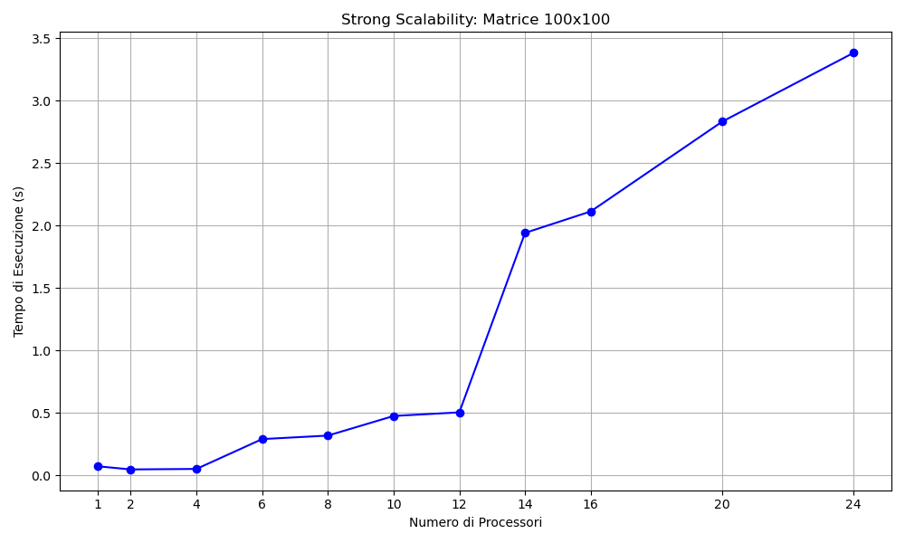           |  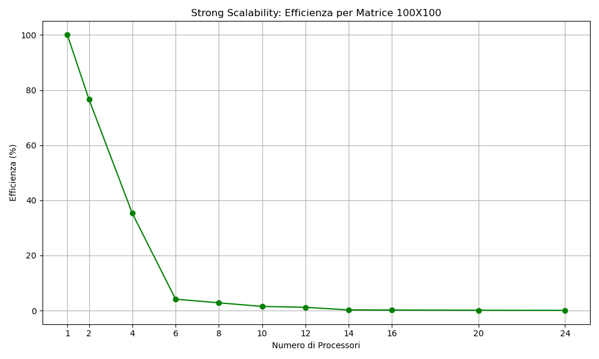          |
| :--------------------------------------------------------------------: | :----------------------------------------------------------------------: |

#### **Secondo Test: Scalabilità forte su Matrice 1000x1000**
| **vCPUs** | **1** | **2** | **4** | **6** | **8** | **10** | **12** | **14** | **16** | **20** | **24** |
| ----- | ----- | ----- | ----- | ----- | ----- | ----- | ----- | ----- | ----- | ----- | ----- |
| **Tempo** | 7.840 | 5.281 | 6.795 | 6.417 | 6.407 | 6.515 | 6.530 | 8.549 | 9.004 | 9.159 | 9.565 |
| **Efficienza** | 100.00% | 74.3% | 28.9% | 21.5% | 15.3% | 12.0% | 10.0% | 6.5 % | 5.4% | 4.3% | 3.4% |

#### **Grafici**
| 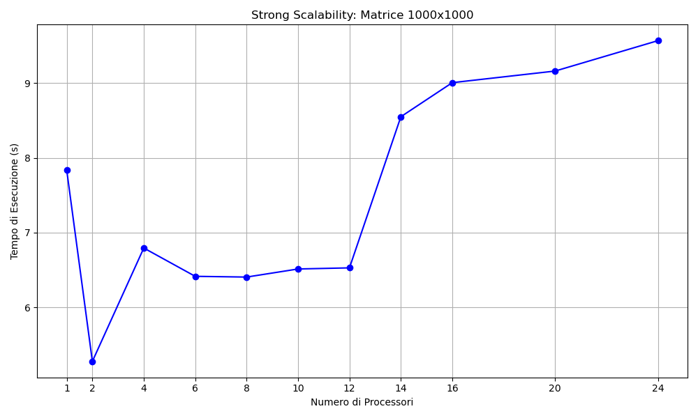           |  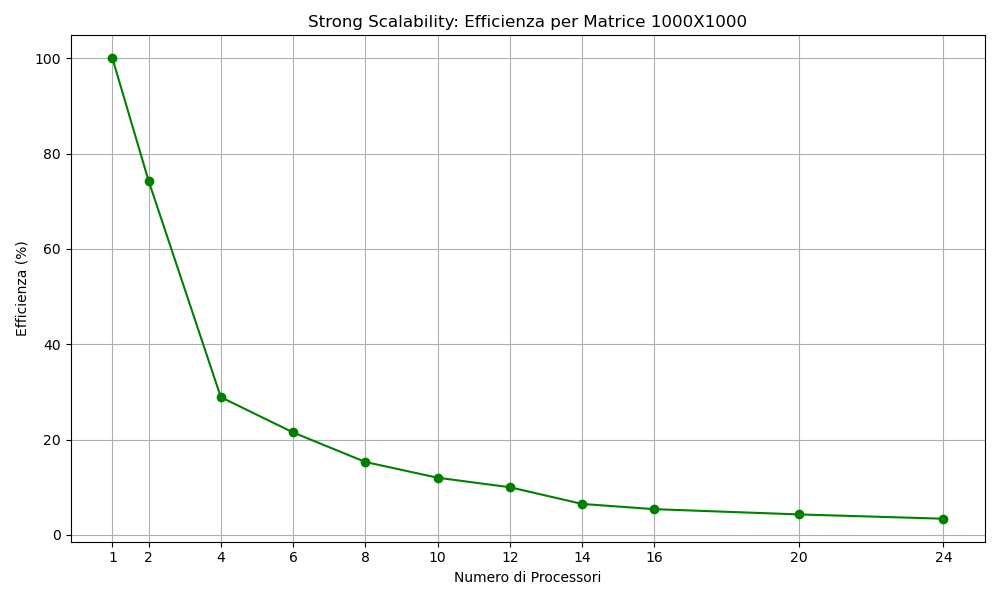          |
| :--------------------------------------------------------------------: | :----------------------------------------------------------------------: |

#### **Terzo Test: Scalabilità forte su Matrice 2500x2500**
| **vCPUs** | **1** | **2** | **4** | **6** | **8** | **10** | **12** | **14** | **16** | **20** | **24** |
| ----- | ----- | ----- | ----- | ----- | ----- | ----- | ----- | ----- | ----- | ----- | ----- |
| **Tempo** | 58.591 | 39.270 | 51.893 | 47.166 | 47.544 | 46.502 | 46.077 | 47.195 | 46.455 | 46.327 | 54.753 |
| **Efficienza** | 100.00% | 74.8% | 28.2% | 20.7% | 15.4% | 12.6% | 10.6% | 8.8% | 7.9% | 6.3% | 4.5% |

#### **Grafici**
| 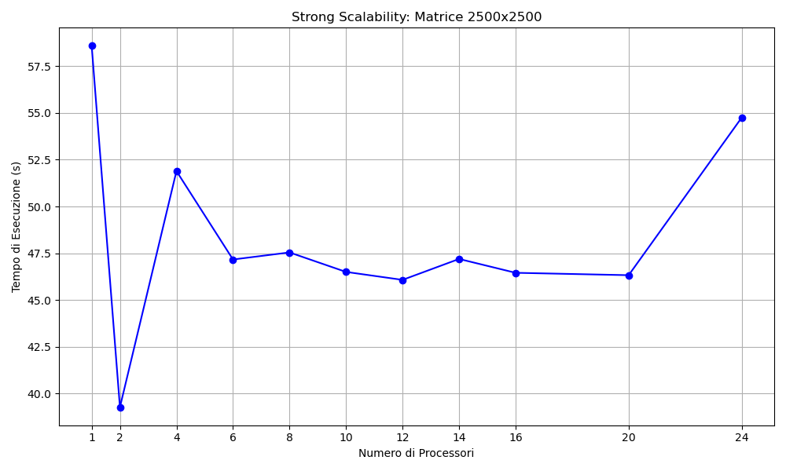           |            |
| :--------------------------------------------------------------------: | :----------------------------------------------------------------------: |

#### **Quarto Test: Scalabilità forte su Matrice 5000x5000**
| **vCPUs** | **1** | **2** | **4** | **6** | **8** | **10** | **12** | **14** | **16** | **20** | **24** |
| ----- | ----- | ----- | ----- | ----- | ----- | ----- | ----- | ----- | ----- | ----- | ----- |
| **Tempo** | 241.402 | 171.432 | 221.844 | 210.262 | 204.048 | 201.833 | 205.468 | 200.134 | 215.140 | 221.433 | 235.401 |
| **Efficienza** | 100.00% | 70.4% | 27.1% | 19.1% | 14.8% | 11.9% | 9.8% | 8.6% | 7.0% | 5.4% | 4.3% |

#### Grafici
| 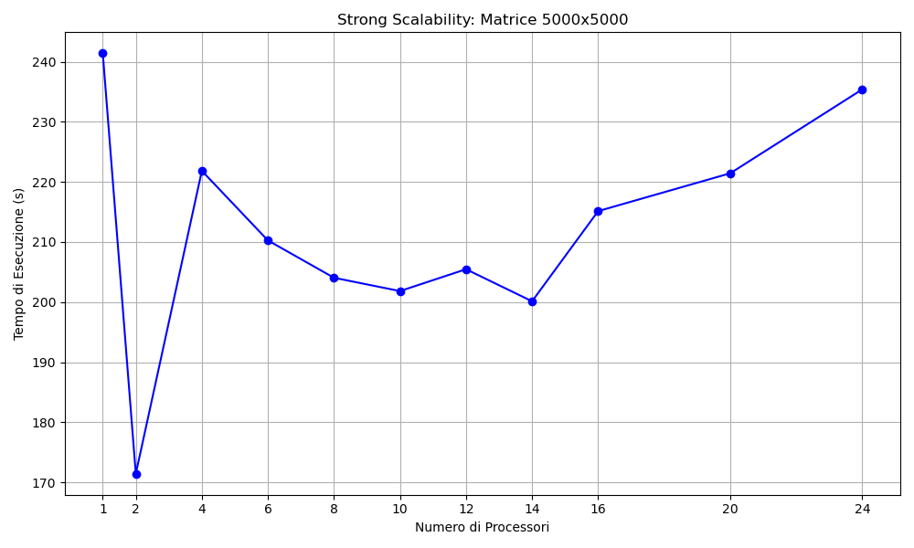           |  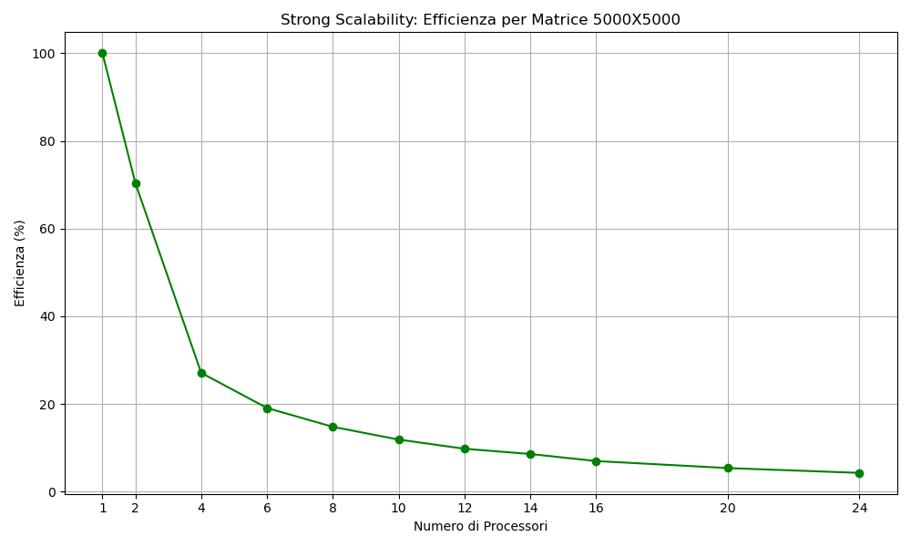          |
| :--------------------------------------------------------------------: | :----------------------------------------------------------------------: |

### **Scalabilità Debole**
La scalabilità debole valuta le prestazioni di un sistema quando sia la dimensione del problema sia il numero di processori vengono aumentati proporzionalmente. La scalabilità debole è regolata dalla legge di Gustafson, che suggerisce che l'aumento della dimensione del problema può compensare l'inefficienza introdotta dall'aumento del parallelismo. 

L'efficienza della scalabilità debole Ep può essere calcolata con la seguente formula:

```math
Ep = (T1/Tp)*100
```
Dove T1 è il tempo di esecuzione su un singolo processore per una dimensione di problema più piccola, Tp è il tempo di esecuzione su P processori con una dimensione del problema proporzionalmente più grande.

L'obiettivo della scalabilità debole è dunque aumentare la dimensione del problema in modo proporzionale all'aumento delle risorse, mantenendo costante il tempo di esecuzione (o con un leggero aumento).

Per valutare la scalabilità debole, l'idea era di garantire che ogni processore avesse sempre lo stesso carico di lavoro, indipendentemente dal numero di processori utilizzati. A questo fine, è stata utilizzata una matrice con 1000 colonne e un numero variabile di righe, specificatamente 1000 righe per ogni vCPU. Questa è stata poi testata su 1, 2, 4, 6, 8, 10, 12, 14, 16, 20 e 24 vCPUs.

#### **Quinto Test: Scalabilità debole su Matrice NX1000**

|   **Dimensione Matrice**    |              **vCPU**                 |             **Tempo**               |         **Efficienza**         |
| :---------------------: | :-------------------------------: | :-----------------------------: | :------------------------: |
|      **1000x1000**      |               1                   |             7.462               |            100%            |
|      **2000x1000**      |               2                   |            10.759               |           69.4%            |
|      **4000x1000**      |               4                   |            31.651               |           23.6%            |
|      **6000x1000**      |               6                   |            45.445               |           16.4%            |
|      **8000x1000**      |               8                   |            63.120               |           11.8%            |
|     **10000x1000**      |              10                   |            76.812               |            9.7%            |
|     **12000x1000**      |              12                   |            97.982               |            7.6%            |
|     **14000x1000**      |              14                   |           110.650               |            6.7%            |
|     **16000x1000**      |              16                   |           124.961               |            6.0%            |
|     **20000x1000**      |              20                   |           160.139               |            4.7%            |
|     **24000x1000**      |              24                   |           220.229               |            3.4%            |

#### **Grafici**
| 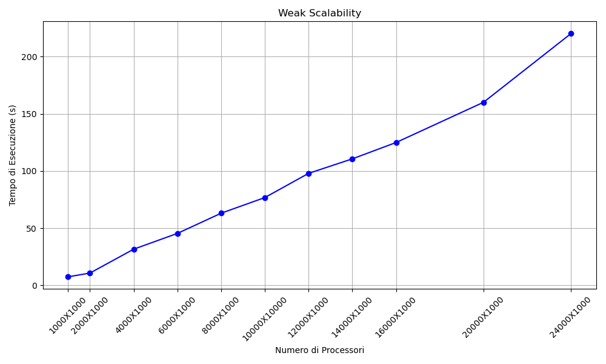                     |  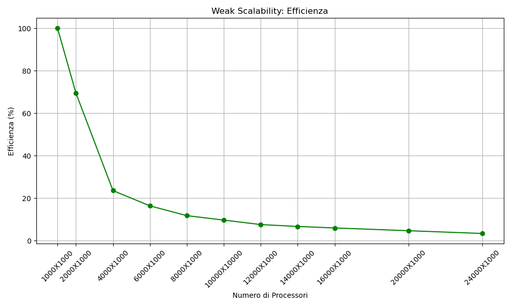                    |
| :--------------------------------------------------------------------: | :----------------------------------------------------------------------: |

### **Risultati Ottenuti**
I risultati ottenuti evidenziano varie tendenze in termini di efficienza e tempi di computazione all'aumentare del numero di processori.

#### **Scalabilità Forte**
Nel caso della scalabilità forte, dove la dimensione dell'input è stata mantenuta costante, è chiaro che vi è un beneficio in termini di performance con l'introduzione del calcolo parallelo. Tuttavia, con l'aumentare del numero di vCPUs, l'efficienza tende a calare. Questo potrebbe essere attribuito all'overhead crescente dovuto alla comunicazione tra i processori.

Ad esempio, per la matrice di dimensione 100x100, l'efficienza si è ridotta drasticamente quando il numero di vCPUs è aumentato, con valori di efficienza che scendono allo 0.09% con 24 vCPUs. Anche per le matrici di dimensione superiore, il trend è simile, anche se i valori di efficienza variano.

Emerge che il miglior equilibrio tra efficienza e tempo di computazione si verifica con un numero di vCPUs intorno a 2. Mentrei tempi di computazione più brevi sono ottenuti utilizzando un numero maggiore di processori, il costo in termini di efficienza diventa sempre più significativo con l'aumento delle vCPUs.

#### **Scalabilità Debole**
Per quanto riguarda la scalabilità debole, l'obiettivo era garantire che ogni processore avesse lo stesso carico di lavoro. Tuttavia, nonostante l'incremento delle righe della matrice proporzionale al numero di vCPUs, i tempi di computazione hanno mostrato un aumento significativo. In particolare, con 24 vCPUs, il tempo è salito a 220.229 secondi, con un'efficienza del 3.4%. Questo sottolinea che, nonostante l'incremento proporzionale del carico, l'overhead di comunicazione ha un impatto significativo sui tempi di computazione e sull'efficienza.

## **Conclusioni**
I benchmark effettuati hanno permesso di comprendere l'efficacia dell'implementazione parallela. Mentre vi è un chiaro vantaggio iniziale nell'adozione della computazione parallela, il ritorno in termini di performance diventa marginale all'aumentare del numero di vCPUs, principalmente a causa dell'overhead di comunicazione. La scelta del numero ottimale di processori dipende quindi da un bilanciamento tra efficienza e tempi di computazione. Ulteriori ottimizzazioni potrebbero essere necessarie per massimizzare l'efficienza nelle configurazioni con un numero elevato di processori.
